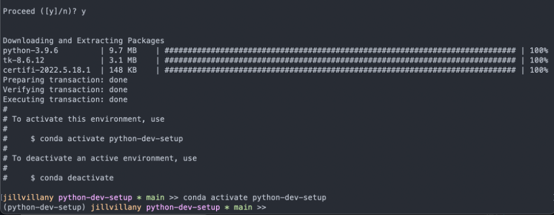

# python-dev-setup

## Table of Contents

1. [Run Scripts from Command Line - Mac Terminal/ Windows WSL](#2-run-scripts-from-command-line---mac-terminal-git-bash)
    - [Set Up a WSL Environment](#set-up-a-wsl-environment)
    - [Format Your Terminal](#Format-Your-Terminal)
2. [Version Control Your Code - Git](#1-version-control-your-code---git)
    - Install Git
        - [Mac](#Mac-Git-Install) 
        - [Windows WSL](#Windows-WSL-Git-Install)
        - [Red Hat Linux](#Red-Hat-Linux-Git-Install)
    - [Set Git Username and Email](#set-git-username-and-email)
    - [Configure SSH Auth](#Configure-SSH-Auth)
        - [Personal Machine](#personal-machine-ssh-auth)
        - [Shared Machine](#shared-machine-ssh-auth)
        - [Machine Type Agnostic Steps](#machine-type-agnostic-steps)
    - [Useful Git Commands](#Useful-Git-Commands) 
3. [Edit and Debug Your Code - VS Code](#3-edit-and-debug-your-code---vscode)
    - [Install VS Code and Key Extensions](#Install-VS-Code-and-Key-Extensions)
    - [Use VSCode with WSL](#use-vscode-with-wsl)
    - [Configure Remote-SSH Editing](#configure-remote-ssh-editing)
4. [Manage Your Python Version - Mambaforge](#4-manage-your-python-version---mambaforge)
    - Install Mambaforge
        - [Mac](#mac-mambaforge-install)
        - [Windows WSL/ Linux](#windows-wsl-linux-mambaforge-install)
    - [Useful Mambaforge Commands](#useful-mambaforge-commands)
5. [Manage Your Python Package Versions - Poetry](#5-manage-your-python-package-versions---poetry)
    - [Install Poetry](#Install-Poetry)
    - [Use Poetry To Install Project Dependencies](#use-poetry-to-install-project-dependencies)
    - [Useful Poetry Commands](#Useful-Poetry-Commands)

<hr>

## 1. Run Scripts from Command Line - Mac Terminal/ Windows WSL
[Back to Table of Contents](#Table-of-Contents)

Mac's Terminal app is ideal for this because Mac has a Linux based OS and most apps are deployed to Linux machines in Production due to their cost effectiveness. 

Since Window's is not a Linux based OS, you can set up a Linux virtual environment with WSL.

### Set Up a WSL Environment
[Back to Table of Contents](#Table-of-Contents)
[WSL Article Reference](https://docs.microsoft.com/en-us/windows/wsl/install)

NOTE: If you already have a legacy version of WSL installed (i.e. WSL1 instead of WSL2), uninstall it so you can follow the install steps below

1. Run Windows PowerShell as an administrator and select yes to the prompt asking if you want to allow the app to make changes to your device
    - 
2. Run the command `wsl --install`
    - This will take a few minutes, but on successful complete, you should see the below output
    - 
3. Restart your computer
4. When you log back in, you will now see an Ubunutu terminal loaded
    - 
5. Close out of the Ubuntu window, and open PowerShell
6. Run the command `wsl -l -v` to list your installed Linux DIstributions and you should see something like the following
    - NOTE: The star next to the Ubuntu-20.40 distribution means this is the default distribution that will be used when launching WSL
    - 
7. To launch your default Linux distribution from PowerShell, simply run the command `wsl`
    - 


### Format Your Terminal
[Back to Table of Contents](#Table-of-Contents)

No matter the command line interface (CLI) used, it helps to format your CLI to work well with Git so that you know what branch you are working on and don't accidentally commit code to the wrong branch.

**NOTE:** Code below found in [this Medium article](https://medium.com/@charlesdobson/how-to-customize-your-macos-terminal-7cce5823006e)

1. Open your terminal of choice (i.e. Mac users default terminal/ Windows users WSL)
2. Cd to your home directory
    - ```cd ~```
3. Create .bash_profile file if it doesn't already exist
    - ```touch .bash_profile```
4. Open .bash_profile
    - Mac: ```open .bash_profile```
    - WSL: ```vim .bash_profile```
5. Add this line to the bottom of the file
    - ```source ~/.bash_prompt```
    - NOTE: In vim, type `i` to enter INSERT mode and then right click to paster the copied text. Press `esc` to exit INSERT mode. Type `:wq` and press enter to save and close the file.
6. Create .bash_prompt file
    - ```touch .bash_prompt```
7. Open .bash_prompt file
    - Mac: ```open .bash_prompt``` 
    - Windows: ```notepad .bash_prompt``` 
8. Add these lines to your file
    ```
    #!/usr/bin/env bash
    
    # GIT FUNCTIONS
    git_branch() {
    git branch 2>/dev/null | sed -e '/^[^*]/d' -e 's/* \\(.*$ \\(.*\\)/  (\\1)/'
    }

    # TERMINAL PROMPT
    PS1="\[\e[0;93m\]\u\[\e[m\]"    # username
    PS1+=" "    # space
    PS1+="\[\e[0;95m\]\W\[\e[m\]"    # current directory
    PS1+=" "      # space
    PS1+="\[\e[0;92m\]\$(git_branch)\[\e[m\]"  # current branch
    PS1+=" "      # space
    PS1+=">> "    # end prompt
    export PS1;

    export CLICOLOR=1
    export LSCOLORS=ExFxBxDxCxegedabagacad
    ```
9. Relaunch you terminal and navigate to a git repo (i.e. this python-dev-setup repo). You will now see your terminal prompt formatted with your username, current folder and repo branch 
    - Mac:
        - 
    - WSL: 
        - 
        - 


## 2. Version Control Your Code - Git

### Mac Git Install
[Back to Table of Contents](#Table-of-Contents)

1. 	Install Apple Xcode developer tools
    - ```xcode-select --install```
2. Download Homebrew: https://brew.sh/
    - Homebrew helps you easily manage installs on a Mac from command-line
3. Install git using homebrew <br>
    - ```brew install git```

### Windows WSL Git Install
[Back to Table of Contents](#Table-of-Contents)

1. From PowerShell, open your Ubuntu Linux distribution with `wsl` and run the command ` apt install git`
    - 
    - NOTE: If you forgot your password (or were not prompted to set one upon initial WSL install), you can reset your password using the following steps:
        - Exit the Linux distribution you are in with the command `exit`
        - Re-enter the Linux distribution as the root user `wsl -u root`
        - Enter the command `passwd {your username}` and type in the new password
            - 
            - NOTE: your username is what you saw in the command prompt when you weren't at the root
                - 
        - Exit the Linux Distribution with `exit`

### Red Hat Linux Git Install
[Back to Table of Contents](#Table-of-Contents)

1. Switch to the super user (a.k.a root user)
    - ```sudo su```
2. Enter your password
3. Install git
    - ```yum install git```
4. Switch back to a normal user
    - ```exit```

### Set Git Username and Email

In order to commit/ push code to Git you must configure your username and email.

1. `git config --global user.name {your username}`
2. `git config --global user.email {your email}`

### Configure SSH Auth
[Back to Table of Contents](#Table-of-Contents)

To easily authenticate with Github/ Bitbucket (i.e. not need to enter your username/ password every time you pull/push to the repo) you can set up SSH authentication.

Setting up git authentication on a personal machine (i.e. one that only you will be using) is very simple. However, if multiple user may be using the machine (i.e. a Linux Machine shared by a development team) you will want to follow a few additional step so that commits can be distinguished by user.


#### Personal Machine SSH Auth

1. Create an SSH key pair with the command `ssh-keygen` and press enter to accept all the default
    - 
2. Copy the content of the id_rsa.pub file using the `cat {path to your file}` command
    - For example, `cat ~/.ssh/id_rsa.pub`
3. See the [Machine Type Agnostic Steps](#machine-type-agnostic-steps) section for remaining steps

#### Shared Machine SSH Auth

1. Create an SSH key pair with the command `ssh-keygen`, adding your git profile to the end of the id_rsa file name instead of accepting all default
    - For example: 
        `Users/jillvillany/.ssh/id_rsa_jillvillany`
        - 
2. Navigate to where the ssh key pair was created using the `cd {path to ssh folder}` command
    - For example: `cd Users/jillvillany/.ssh`
3. Create the config file
    ```
    touch config
    vim config
    ```
    - **NOTE:** Git username vairable is case sensitive
    - If using Github, add the below to your config file:
        ```
        Host github-{git username}
         HostName github.com
         IdentityFile ~/.ssh/id_rsa_{git username}
         IdentitiesOnly yes
        ```
    - If using Github Enterprise (i.e. IBM), add the below to yuur config file:
        ```
        Host github-{git username}
            HostName github.ibm.com
            IdentityFile ~/.ssh/id_rsa_{git username}
            IdentitiesOnly yes
        ```
    - If Bitbucket:
        ```
        Host bitbucket.org-{git username}
         HostName bitbucket.org
         User git
         IdentityFile ~/.ssh/id_rsa_{git username}
         IdentitiesOnly yes
        ```
    - **NOTE:** If you have other users to add, create similar entries below in the file
4. Copy the contents of the `id_rsa_{git username}.pub` file using the `cat id_rsa_{git username}.pub` command

#### Machine Type Agnostic Steps

5. Add SSH key in Github or Bitbucket  
    - In Github:
        - Navigate to Settings > SSH and GPG keys
        - 
        - Click New SSH key and add the contents of your `id_rsa_{git username}.pub` file in the key field
    - In Bitbucket:
        - Navigate to personal settings
        - 
        - Select SSH Key > Add Key add the contents of your `id_rsa_{git username}.pub` file in the key field
6. Add the SSH key to the SSH agent
    ```
    ssh-add ~/.ssh/id_rsa_{git username}
    ```
    - NOTE: if you get an error about connecting to the ssh agent, you need to start the agent in the background with "eval \`ssh-agent\`"
    - 
7. Test your SSH connection
    - If on a personal machine:
        - Github: ```ssh -T git@github.com```
            - 
        - Github Enterprise (i.e. IBM): ```ssh -T git@github.ibm.com```
        - Bitbucket: ```ssh -T git@bitbucket.org```
    - If on a shared machine:
        - Github: ```ssh -T git@github-{your username}```
        - Github Enterprise (i.e. IBM): ```ssh -T git@github.ibm-{your username}```
        - Bitbucket: ```ssh -T git@bitbucket.org-{your username}```


### Useful Git Commands
[Back to Table of Contents](#Table-of-Contents)

- Clone repo with SSH auth
    - **IMP NOTE**: If you are an SSH config file so multiple git users can be on the same machine (i.e. as done in instructions above), you must modify the SSH URL git provides
        - For example, in `git@github.com:jillvillany/python-dev-setup.git` replace ".com" with "-{username}" -> `git@github-jillvillany:jillvillany/python-dev-setup.git`
    - On a new repo:
        - Select SSH when you clone the code and copy the URL
            - 
        - Enter the command ```git clone {SSH URL}```
            - For example: `git clone git@github.com:jillvillany/python-dev-setup.git`
            - 
    - On an existing git repo (i.e. if had cloned this repo using username and password auth)
        - Set the remote URL to the URL used with ssh
        - ```git remote set-url origin {SSH URL}```
        - Now try ```git push```
        - Answer yes to the prompt and you will see git connects/ shows everything up to date without prompting for username/ password
            - 


- Add new/ modified files, commit and push changes
    ```
    git pull 
    git add {relative file path}
    git commit -m "commit message"
    git push
    ```
    - **IMPORTANT:** If multiple users are working in the directory, be sure to set the git config user.email before pushing so that commits belong to the user that made the change
    ```
    git config user.email {your email}
    ```
- Undo all local changes to the checked out branch
    ```
    git stash
    ```
- Undo local changes to a particular file
    ```
    git checkout --{file name}
    ```
- Create a New Branch
    ```
    git checkout -b {branch name} {branch making new branch from}
    git push -u origin {branch name}
    ```
- Abort a merge
    ```
    git merge --abort
    ```
- Revert to a previous commit
    ```
    git revert {commit hash}
    ```
    - **NOTE:** See [this stack overflow post](https://stackoverflow.com/questions/4114095/how-do-i-revert-a-git-repository-to-a-previous-commit) for more details
- Archive & Delete a Branch
    ```
    git tag archive/{branchname} {branchname}
    git push origin --tags
    git branch -d {branchname}
    git push -d origin {branch_name}
    ```
    - **NOTE:** If need to delete a created tag
    ```
    git tag -d
    ```
    - **NOTE:** The process of archiving numerous branches can get tedious. See the [archive_branch.sh](https://github.com/jillvillany/python-dev-setup/blob/main/archive_branch.sh) script in this repo for an automated way to archive branches.
- Restore an archived branch
    ```
    git checkout -b {branch name} archive/{archived branch name}
    ```
-  Maintain a Forked Repo
    - Sync your forked version of the repo with the most updated version of the main repo
        - ```git checkout master```
        - If not already done: ```git remote add upstream https://github.ibm.com/ML-Pipelines/ml-pipelines.git``` 
        - ```git fetch upstream```
        - ```git rebase upstream/master```
        - ```git push -u origin```

For other useful commands delivered in an entertaining way see: https://ohshitgit.com/


## 3. Edit and Debug Your Code - Vscode
[Back to Table of Contents](#Table-of-Contents)

### Install VS Code and Key Extensions

1. Download Vscode: https://code.visualstudio.com/download
2. Install the extensions below:

    - Python
        - Extension ID: ms-python.python
        - 
    - Jupyter
        - Extension ID: ms-toolsai.jupyter
        - 
     - Prettify JSON
        - Extension ID: mohsen1.prettify-json
        - 
    - JSON Viewer
        - Extension ID: ccimage.jsonviewer
        - 
    - Markdown Preview Enhanced
        - Extension ID: shd101wyy.markdown-preview-enhanced
        - 
    - Rainbow CSV
        - Extension ID: mechatroner.rainbow-csv
        - 
    - vscode-pdf
        - Extension ID: tomoki1207.pdf
        - 
    - Remote-SSH
        - Extension ID: ms-vscode-remote.remote-ssh
        - 
    - Remote-WSL (only if using Windows WSL)
        - Extension ID: ms-vscode-remote.remote-wsl
        - 


### Use VSCode with WSL
[Back to Table of Contents](#Table-of-Contents)


1. Once you install tyhe Remote-WSL, navigate to the Remote Explorer tab and connect to your WSL distribution
    - 
2. Navigate to open a folder as you normally would
    - 


### Configure Remote-SSH Editing
[Back to Table of Contents](#Table-of-Contents)

When project files are hosted on a Linux Machine, you can easily edit/ debug them as you would local files by taking advantage of VS Code's Remote-SSH extension.

To use SSH to connect to a remote Linux machine:

1. Open the Command Palette 
    - Mac: `shift + cmd + P`
    - Windows: `shift + ctrl + P`
2. Search for/ Select Remote-SSH: Add New SSH Host...
    - 
3. Enter the ssh connection command 
    - `ssh {username}@{ip}`
    - 
4. Select the ssh file to update 
    - 
5. You will see a pop-up in the bottom right corner that the host has been added
    - 
6. In the Remote Explorer tab, you will now see your new SSH Target. Click the plus folder icon to "Connect to Host in New Window"
    - 
7. A new window will open and you will be prompted to enter your password
    - 
8. Choose the folder in the remote machine you want to open and select "OK"    
    - 
9. You will be prompted for your password one more time
    - 
10. Upon successful connection, you will see the remote machine's ip as well as the git branch you are currently on (if opened to a git repo) in the bottom left corner
    - 

You can now easily edit and debug your code as you would locally. However, there is one exception. If you are connecting to the remote machine with a normal user (i.e. non-root user) you will get access errors when trying to run a ipynb file.


This happens because, in a Unix/Linux system, you can’t bind to external facing ports without super user/root access. 

If you do not have an environment controlled with Puppet, you can try editing the user's permissions to not need password authentication when entering root user mode. However, it is easiest to just test small code snippets in a noteboook file locally.

For more information, see [https://code.visualstudio.com/docs/remote/ssh](https://code.visualstudio.com/docs/remote/ssh)


## 4. Manage Your Python Version - Mambaforge
[Back to Table of Contents](#Table-of-Contents)


### Mac Mambaforge Install
[Back to Table of Contents](#Table-of-Contents)

1. Install `wget`
    ```bash
    brew install wget
    ```
2. Install Mambaforge (Type "yes" wherever asked)
    ```bash
    wget "https://github.com/conda-forge/miniforge/releases/latest/download/Mambaforge-$(uname)-$(uname -m).sh"
    bash Mambaforge-$(uname)-$(uname -m).sh
    ```

### Windows WSL/ Linux Mambaforge Install
[Back to Table of Contents](#Table-of-Contents)

1. Install `wget` 
    ```bash
    sudo apt install wget
    ```
3. Install Mambaforge (Type "yes" wherever asked)
    ```bash
    wget "https://github.com/conda-forge/miniforge/releases/latest/download/Mambaforge-$(uname)-$(uname -m).sh"
    bash Mambaforge-$(uname)-$(uname -m).sh
    source ~/.bashrc

### Useful Mambaforge Commands
[Back to Table of Contents](#Table-of-Contents)

- Create new conda python virtual environment
    * Note: If it asks you to select y/n, enter "y"
        ```bash
        conda create -n {name} python={version}
        ```
- Activate conda environment
    ```bash
    conda activate {name}
    ```
- Deactivate conda environment
    ```bash
    conda deactivate
    ```


## 5. Manage Your Python Package Versions - Poetry
[Back to Table of Contents](#Table-of-Contents)

### Install Poetry

- Install `poetry` with the following command:
    ```curl -sSL https://raw.githubusercontent.com/python-poetry/poetry/master/get-poetry.py | python -```
- Restart your terminal
- Enter `poetry` and you should see a list of commands returned

### Use Poetry To Install Project Dependencies
[Back to Table of Contents](#Table-of-Contents)

**NOTE:** For demo purposes, let's pretend this project is dependent on Python version 3.9.6 and pandas

1. Create a `pyproject.toml` file using the following template (See this repo's [pyproject.toml](https://github.com/jillvillany/python-dev-setup/blob/main/pyproject.toml)):
    - NOTE: We are assuming this repo represents a project dependent on Python version 3.9.6 and a pandas version greater than or equal to 1.4.1

        ```
        [tool.poetry]
        name = "{repo/project name}"
        version = "1.0.0"
        description = "{free text description}"
        readme = "README.md"
        repository = "{git repo link}"
        documentation = "{site url if applicable}"
        authors = [
            "{full name} <{email}>"
        ]

        [tool.poetry.dependencies]
        python = "=={Python version}"

        [tool.poetry.dev-dependencies]

        [build-system]
        requires = ["poetry-core>=1.0.0"]
        build-backend = "poetry.core.masonry.api"
        ```
        
2. Create a conda environment that uses the Python version specified in the `pyproject.toml` file and active the environment

    - `conda create -n python-dev-setup python=3.9.6`
    - 


3. Run command `poetry install`

    - 
    - NOTE: You will see a `poetry.lock` file created. This is important to be committed to your repo so that other team members can install the dependencies from the lock file by running `poetry install`


### Useful Poetry Commands
[Back to Table of Contents](#Table-of-Contents)

- Install the requirements in the poetry.lock file
    ```
    poetry install
    ```
- Add a package to the pyproject.toml file and update lock file
    ```
    poetry add {package name}
    ```
    - **NOTE1:** This will install the latest package version. The pyproject.toml will show a version greater than or equal to the version is required and the poetry.lock file will update to specify the specific version installed.
     - **NOTE2:** If you need to install a version other than the latest version, you can specify `poetry add {package name}=={version}`
- Remove a package from the pyproject.toml file and update lock file
    ```
    poetry remove {package name}
    ```
