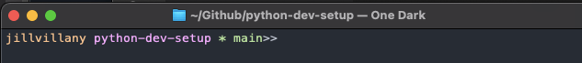

# python-dev-setup

testing archive branch commands

## Table of Contents

1. [Set Up Components](#Set-Up-Components)
2. [Apple Xcode and Homebrew Install (MAC ONLY)](#Apple-Xcode-and-Homebrew-Install-(MAC-ONLY))
3. [Git Install](#Git-Install) <br>
    A. [Mac](#Mac-Git-Install) <br>
    B. [Windows](#Windows-Git-Install) <br>
    C. [Clone Repo with SSH Auth](#Clone-Repo-with-SSH-Auth) <br>
    D. [Useful Commands](#Useful-Git-Commands) <br>
4. [Vscode Install](#Vscode-Install)
5. [Pyenv Install](#Pyenv-Install) <br>
    A. [Mac](#Mac-Pyenv-Install) <br>
    B. [Windows](#Windows-Pyenv-Install) <br>
    C. [Linux](#Linux-Pyenv-Install) <br>
    D. [Useful Commands](#Useful-Pyenv-Commands) <br>
6. [Poetry Install](#Poetry-Install)
7. [Format Your Terminal](#Format-Your-Terminal)

## Set Up Components

Optimal setup for Python developers includes the following components:


1. Version Control - Git
    - Includes Git Bash terminal on Windows
2. Code editor
    - Recommend: Vscode
    - Rationale: Debugging capabilities of Pycharm with better code function lookup across imported files/ packages as well as functionality to run Jupyter notebooks
    - Exception: When working with files on remote Linux server, recommend using Atom with the ftp-remote-edit package
3. Python version manager
    - Recommend: pyenv
    - Rationale: More lightweight than anaconda and open source
4. Python package dependency manager
    - Recommend: poetry
    - Rationale: Account for dependencies of package dependencies (not handled by creating a venv with hard-coded package versions)
5. Terminal formatting (optional)
    - Recommend: Formatting prompt to show user, cwd and git branch (if applicable)
    - Rationale: Ensure work done on/ changes pushed to appropriate branch

With these components in place, new users/ team members can easily get code running by ensuring all depdencies (Python version/ Python package versions) are the same.
<br>

## Apple Xcode and Homebrew Install (MAC ONLY)

1. 	Install Apple Xcode developer tools
    ``` code-select --install```
2. Download Homebrew: https://brew.sh/
    - Homebrew helps you easily manage installs on a Mac from command-line


## Git Install

### Mac Git Install
1. Install git using homebrew <br>
    ```brew install git```

#### Set Up SSH Auth

To easily authenticate with github (i.e. not need to enter your username/ password every time you pull/push to the repo) you can set up SSH authentication

1. Create an ssh key pair
    - ```ssh-keygen```
    - NOTE: In order to make the setup flexible to multiple different user accounts on the same machine (helpful when working on a project team's remote desktop) add your git profile to the end of the id_rsa file name
        - For example: `Users/jillvillany/.ssh/id_rsa_jillvillany`
    - 
2. Navigate to where the ssh key pair was created 
    - Mac: use shortcut `shift + cmd + .` to view hidden directories/files
    - Linux WinSCP: Options > Preferences > Panels > Show hidden files
3. Create the config file (in finder or in terminal using below commands)
    ```
    cd ~/.ssh
    touch config
    open config
    ```
    - If using Github, add the below to your config file:
        ```
        Host github-{git username}
         HostName github.com
         IdentityFile ~/.ssh/id_rsa_{git username}
         IdentitiesOnly yes
        ```
    - If Bitbucket:
        ```
        Host bitbucket.org-{git username}
         HostName bitbucket.org
         User git
         IdentityFile ~/.ssh/id_rsa_{git username}
         IdentitiesOnly yes
        ```
    - NOTE: If you have other users to add, create similar entries below in the file
4. Open the `id_rsa_{git username}.pub` file with a text editor and copy the contents
5. Add SSH key in Github or Bitbucket  
    - In Github:
        - Navigate to Settings > SSH and GPG keys
        - 
        - Click New SSH key and add the contents of your `id_rsa_{git username}.pub` file in the key field
    - In Bitbucket:
        - Navigate to personal settings
        - 
        - Select SSH Key > Add Key add the contents of your `id_rsa_{git username}.pub` file in the key field
6. Add SSH key to agent:
        ```
        ssh-add ~/.ssh/id_rsa_{git username}
        ```
7. Test your SSH connection to github
    ```
    ssh -T git@github.com
    ssh -T git@github-{git username}
    ```


### Windows Git Install
1. Install git https://git-scm.com/download/win
2. Use git bash as your terminal interface (allows similar commands as mac terminal)
    - Key differences include:
        - ```notepad``` instead of ```open`` for opening a file
        - shift + ins to copy/ paste into/ from the terminal
        - ```python -i``` instead of just ```python``` to use an interactive python shell in the terminal

#### Set Up SSH Auth

To easily authenticate with github (i.e. not need to enter your username/ password every time you pull/push to the repo) you can set up SSH authentication

1. Create an ssh key pair
    - ```ssh-keygen -t ed25519 -C "your_email@example.com```
2. Navigate to where the ssh key pair was created 
4. Open the `id_ed25519` PUB file with a text editor and copy the contents
5. Add SSH key in Github or Bitbucket  
    - In Github:
        - Navigate to Settings > SSH and GPG keys
        - 
        - Click New SSH key and add the contents of your `id_ed25519.pub` file in the key field
    - In Bitbucket:
        - Navigate to personal settings
        - 
        - Select SSH Key > Add Key add the contents of your `id_ed25519.pub` file in the key field
6. Add SSH key to agent:
    - Start up SSH agent in background
        ```
        eval $(ssh-agent -s)
        ```
    - Add the identity
        ```
        ssh-add ~/.ssh/id_ed25519
        ```
7. Test your SSH connection to github
    ```
    ssh -T git@github.com
    ```


### Clone Repo with SSH Auth

- On a new repo:
    - select SSH when you clone the code and copy the URL
        - 
    - In terminal ```git clone {SSH URL}```
        - For example: `git clone git@github.com:jillvillany/python-dev-setup.git`
        - 
- IMPORTANT: If multiple users are working in the directory, be sure to set the git config user.email before pushing so that commits belong to the user that made the change
    ```
    git config user.email "{your email}"
    ```

#### Update Existing Repo to SSH

- On an existing git repo (i.e. if had cloned this repo using username and password auth)
    - Set the remote URL to the URL used with ssh
    - ```git remote set-url origin {SSH URL}```
    - Now try ```git push```
    - Answer yes to the prompt and you will see git connects/ shows everything up to date without prompting for username/ password
        - 

### Useful Git Commands

- Add, Commit and Push changes
    ```
    git pull 
    git add {file path}
    git commit -m "commit message"
    git push
    ```
- Undo all changes
    ```
    git stash
    ```
- Undo changes to particular file
    ```
    git checkout --{file name}
    ```
- Create New Branch
    ```
    git checkout -b {branch name} {branch making new branch from}
    git push -u origin {branch name}
    ```
- Archive & Delete a Branch
    ```
    git tag archive/{branchname} {branchname}
    git push origin --tags
    ```
    - Git tag (use down arrow to scroll down and check you see the tag)
    ```
    git branch -d {branchname}
    git push -d origin {branch_name}
    ```
    - NOTE: If need to delete a created tag
    ```
    git tag -d
    ```
-  Maintain a Forked Repo
    - Sync your forked version of the repo with the most updated version of the main repo
        - ```git checkout master```
        - If not already done: ```git remote add upstream https://github.ibm.com/ML-Pipelines/ml-pipelines.git``` 
        - ```git fetch upstream```
        - ```git rebase upstream/master```
        - ```git push -u origin```

For other useful commands delivered in an entertaining way see: https://ohshitgit.com/


## Vscode Install

1. Download Vscode: https://code.visualstudio.com/download
2. Install the extensions below:

    - Python
    - Jupyter
    - Prettify JSON
    - pdf-view


## Pyenv Install

### Mac Pyenv Install

See this article for reference: https://chamikakasun.medium.com/how-to-manage-multiple-python-versions-in-macos-2021-guide-f86ef81095a6

- Run the following commands in terminal:
    ```
    brew install openssl readline sqlite3 xz zlib
    curl https://pyenv.run | bash
    ```
- Open .bash_profile (create it if needed) 
    ```
    touch ~/.bash_profile # create if needed
    open ~/.bash_profile
    ```
- Add pyenv and pyenv virtualenv path to bash profile
    ```
    export PYENV_ROOT="$HOME/.pyenv"
    export PATH="$PYENV_ROOT/bin:$PATH"
    if command -v pyenv 1>/dev/null 2>&1; then
        eval "$(pyenv init --path)"
        eval "$(pyenv virtualenv-init -)"
    fi
    ```
- Restart terminal
- Type `pyenv` and you should see a list of commands returned
- Test can install a python version with pyenv
    `pyenv install 3.8.3`
    - NOTE1: If you get an error, try running this patch command (make sure the version after patch matches the version you are installing)
    ```
    CFLAGS="-I$(brew --prefix openssl)/include -I$(brew --prefix bzip2)/include -I$(brew --prefix readline)/include -I$(xcrun --show-sdk-path)/usr/include" LDFLAGS="-L$(brew --prefix openssl)/lib -L$(brew --prefix readline)/lib -L$(brew --prefix zlib)/lib -L$(brew --prefix bzip2)/lib" pyenv install --patch 3.8.3 < <(curl -sSL https://github.com/python/cpython/commit/8ea6353.patch\?full_index\=1)
    ```
    - NOTE2: If your error looks like the error below, try this fix instead:
        - Error:
            ```
            /Library/Developer/CommandLineTools/SDKs/MacOSX12.1.sdk/usr/include/mach-o/dyld.h:98:54: note: passing argument to parameter 'bufsize' here
            extern int _NSGetExecutablePath(char* buf, uint32_t* bufsize)                 __OSX_AVAILABLE_STARTING(__MAC_10_2, __IPHONE_2_0);
                                                                ^
            ./Modules/posixmodule.c:9221:15: error: implicit declaration of function 'sendfile' is invalid in C99 [-Werror,-Wimplicit-function-declaration]
                    ret = sendfile(in, out, offset, &sbytes, &sf, flags);
            ```
        - Fix:
            - Add explicit dev tools path to ~/.bash_profile
            ```
            ####### adding paths needed for working with different python versions using pyenv #########
            #pyenv
            export PATH="/Users/jillvillany/.pyenv/bin:$PATH"
            eval "$(pyenv init --path)"
            eval "$(pyenv virtualenv-init -)"

            #openssl
            export LDFLAGS="-L/usr/local/opt/openssl@1.1/lib"
            export CPPFLAGS="-I/usr/local/opt/openssl@1.1/include"

            #readline
            export LDFLAGS="-L/usr/local/opt/readline/lib"
            export CPPFLAGS="-I/usr/local/opt/readline/include"

            #sqlite
            export LDFLAGS="-L/usr/local/opt/sqlite/lib"
            export CPPFLAGS="-I/usr/local/opt/sqlite/include"

            #zlib
            export LDFLAGS="-L/usr/local/opt/zlib/lib"
            export CPPFLAGS="-I/usr/local/opt/zlib/include"
            ```
            -  https://github.com/pyenv/pyenv/issues/1643#issuecomment-655710632
            ```
            CFLAGS="-I$(brew --prefix openssl)/include -I$(brew --prefix bzip2)/include -I$(brew --prefix readline)/include -I$(xcrun --show-sdk-path)/usr/include" LDFLAGS="-L$(brew --prefix openssl)/lib -L$(brew --prefix readline)/lib -L$(brew --prefix zlib)/lib -L$(brew --prefix bzip2)/lib" \
            pyenv install --patch 3.8.3 < <(curl -sSL https://github.com/python/cpython/commit/8ea6353.patch\?full_index\=1)
            ```
- Check it's in your Python versions
    `pyenv versions`
- Use pyenv to set your local python version
    `pyenv local 3.8.3`
- Check that your python version is now set to 3.8.3
    `python -V`


### Windows Pyenv Install
- You can follow the first half of the instructions in this article: http://evaholmes.com/how-to-set-up-pyenv-and-poetry-on-windows-10-for-python-project-management/
- Basic steps include:
    - Open git bash
    - cd to home `cd ~`
    - Enter the following command: ```git clone https://github.com/pyenv-win/pyenv-win.git $HOME/.pyenv```
    - Edit your system path variables
        - Search "edit the system environment variables" in windows home menu
            - 
        - Select environment variables
            - 
        - Select Path under System Variables and click Edit
            - 
        - Click New and add the following two paths:
            - c:\users\{your username}\.pyenv\pyenv-win\bin
                - For example: c:\users\jillv\.pyenv\pyenv-win\bin
            - c:\users\{your username}\.pyenv\pyenv-win\shims
                - For example: c:\users\jillv\.pyenv\pyenv-win\shims
        - The environment variables should now look like below:
            - 
        - Click OK to close the windows

    - Relaunch git bash and type ```pyenv``` you should see a list of commands retrun
    - Test can install a python version with pyenv
        `pyenv install 3.8.3`
    - Check it's in your Python versions
        `pyenv versions`
    - Use pyenv to set your local python version
        `pyenv local 3.8.3`
    - Check that your python version is now set to 3.8.3
        `python -V`

- NOTE: You cannot use the pyenv virtualenv plugin with the windows version of pyenv. To make a virtual environment off of a pyenv python version
    ```
    pyenv install 3.8.3   #or any other version
    pyenv local 3.8.3
    python -m venv venv
    ```

### Linux Pyenv Install
- Install pyenv prereqs from root
    ```
    cd ~
    Sudo su – 
    ```
- Install prerequisites based on your Linux distribution
    - On Debian/Ubuntu/Linux Mint 
    ```sudo apt install curl git-core gcc make zlib1g-dev libbz2-dev libreadline-dev libsqlite3-dev libssl-dev```
    - On CentOS/RHEL 
        ```
        yum -y install epel-release
        yum install git gcc zlib-devel bzip2-devel readline-devel sqlite-devel openssl-devel libffi-devel
        ```
	- On Fedora 22+ 
    ```yum install git gcc zlib-devel bzip2-devel readline-devel sqlite-devel openssl-devel libffi-devel```
- Install pyenv from git
    ```git clone https://github.com/pyenv/pyenv.git ~/.pyenv```
- Add the following to ~/.bash_profile
    ```
    export PYENV_ROOT="$HOME/.pyenv"
    export PATH="$PYENV_ROOT/bin:$PATH"
    if command -v pyenv 1>/dev/null 2>&1; then
        eval "$(pyenv init --path)"
        eval "$(pyenv virtualenv-init -)"
    fi
    ```
- Install pyenv virtualenv plugin
    ```git clone https://github.com/pyenv/pyenv-virtualenv.git $(pyenv root)/plugins/pyenv-virtualenv```
- Restart terminal
- Check see command options returned when enter `pyenv` command


### Useful Pyenv Commands
- pyenv install 
    - Install the version of Python needed. For example:
    ```
    pyenv install 3.9.6
    ```
    - NOTE: One Mac, if you get an error, try running this patch command (make sure the version after patch matches the version you are installing)
    ```
    CFLAGS="-I$(brew --prefix openssl)/include -I$(brew --prefix bzip2)/include -I$(brew --prefix readline)/include -I$(xcrun --show-sdk-path)/usr/include" LDFLAGS="-L$(brew --prefix openssl)/lib -L$(brew --prefix readline)/lib -L$(brew --prefix zlib)/lib -L$(brew --prefix bzip2)/lib" pyenv install --patch 3.9.6 < <(curl -sSL https://github.com/python/cpython/commit/8ea6353.patch\?full_index\=1)
    ```
- `pyenv versions`
    - See Python versions and virtual environments aviable to be set as your Python version
- `pyenv local`
    - Set Python version in cwd
- `pyenv global`
    - Set Python version to use system-wide (overwritten by local pyenv is specified)
- Create a virtual env with pyenv (NOT AVAILABLE ON WINDOWS)
    - `pyenv virtualenv {python version} {venv name}`
    - Set venv as the local python for the project
        - `pyenv local {venv name}`
    - Now when you cd into the project's directory, the venv set as the local python version will automatically be activated

## Poetry Install

- Install `poetry` with the following command:
    ```curl -sSL https://raw.githubusercontent.com/python-poetry/poetry/master/get-poetry.py | python -```
- Restart your terminal
- Enter `poetry` and you should see a list of commands returned

## Format Your Terminal

When working with git repos it is easiest if you terminal shows you what branch you are currently in so you don't loose track/ actually make changes to the master version.

1. Open your terminal of choice (i.e. Mac users default terminal/ Windows users git bash)
2. Cd to your home directory
    ```cd ~```
3. Create .bash_profile file if it doesn't already exist (this was part of the Mac set up but not Windows)
    ```touch .bash_profile```
4. Open .bash_profile
    - Mac: ```open .bash_profile```
    - Windows: ```notepad .bash_profile```
5. Add this line to the bottom of the file
    ```source ~/.bash_prompt```
6. Create .bash_prompt file
```touch .bash_prompt```
7. Open .bash_prompt file
    - Mac: ```open .bash_prompt```
    - Windows: ```notepad .bash_prompt```
8. Add these lines to your file
```
#!/usr/bin/env bash

# GIT FUNCTIONS
git_branch() {
git branch 2>/dev/null | sed -e '/^[^*]/d' -e 's/* \\(.*$ \\(.*\\)/  (\\1)/'
}

# TERMINAL PROMPT
PS1="\[\e[0;93m\]\u\[\e[m\]"    # username
PS1+=" "    # space
PS1+="\[\e[0;95m\]\W\[\e[m\]"    # current directory
PS1+=" "      # space
PS1+="\[\e[0;92m\]\$(git_branch)\[\e[m\]"  # current branch
PS1+=" "      # space
PS1+=">> "    # end prompt
export PS1;

export CLICOLOR=1
export LSCOLORS=ExFxBxDxCxegedabagacad
```
9. Relaunch you terminal and navigate to a git repo (i.e. this python-dev-setup repo). You will now see your terminal prompt formatted with your username, current folder and repo branch 

