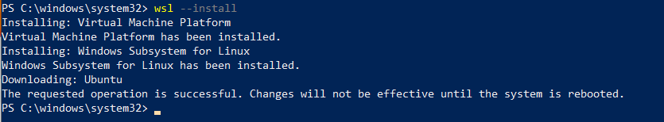
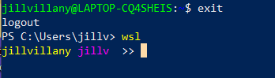

## Mac

Mac's Terminal app is ideal for this because Mac has a Linux based OS and most apps are deployed to Linux machines in Production due to their cost effectiveness. 


## Windows

Since Window's is not a Linux based OS, you can set up a Linux virtual environment with WSL.

### Set Up a WSL Environment

[WSL Article Reference](https://docs.microsoft.com/en-us/windows/wsl/install)

NOTE: If you already have a legacy version of WSL installed (i.e. WSL1 instead of WSL2), uninstall it so you can follow the install steps below

1. Run Windows PowerShell as an administrator and select yes to the prompt asking if you want to allow the app to make changes to your device
    - 
2. Run the command `wsl --install`
    - This will take a few minutes, but on successful complete, you should see the below output
    - 
3. Restart your computer
4. When you log back in, you will now see an Ubunutu terminal loaded
    - 
5. Close out of the Ubuntu window, and open PowerShell
6. Run the command `wsl -l -v` to list your installed Linux DIstributions and you should see something like the following
    - NOTE: The star next to the Ubuntu-20.40 distribution means this is the default distribution that will be used when launching WSL
    - 
7. To launch your default Linux distribution from PowerShell, simply run the command `wsl`
    - 


## Format Your Terminal

No matter the command line interface (CLI) used, it helps to format your CLI to work well with Git so that you know what branch you are working on and don't accidentally commit code to the wrong branch.

### `.bashrc` vs. `.bash_profile`

The code below accounts for proper formatting using both the `.bashrc` and `.bash_profile`. This is important because `.bashrc` is used for inactive logins (i.e. task run in the background like a cron job or VSCode logging into your terminal), and `.bash_profile` is used when you are actively logging in. 

**NOTE:** Code below found in [this Medium article](https://medium.com/@charlesdobson/how-to-customize-your-macos-terminal-7cce5823006e)

1. Open your terminal of choice (i.e. Mac users default terminal/ Windows users WSL)
2. Cd to your home directory
    - ```cd ~```
3. Create `.bash_profile` file if it doesn't already exist
    - ```touch .bash_profile```
4. Open `.bash_profile`
    - Mac: ```open .bash_profile```
    - WSL: ```notepad .bash_profile```
    - Linux: ```vim .bash_profile```
5. Add this line to the bottom of the file
    - ```source ~/.bashrc```
    - NOTE: In vim, type `i` to enter INSERT mode and then right click to paster the copied text. Press `esc` to exit INSERT mode. Type `:wq` and press enter to save and close the file.
6. Create `.bashrc` file if it doesn't already exist
7. Open `.bashrc`
8. Add this line to the bottom of the file
    - ```source ~/.bash_prompt```
9. Create `.bash_prompt file`
10. Open `.bash_prompt` file
11. Add these lines to your file
    ```
    #!/usr/bin/env bash
    
    # GIT FUNCTIONS
    git_branch() {
    git branch 2>/dev/null | sed -e '/^[^*]/d' -e 's/* \\(.*$ \\(.*\\)/  (\\1)/'
    }

    # TERMINAL PROMPT
    PS1="\[\e[0;93m\]\u\[\e[m\]"    # username
    PS1+=" "    # space
    PS1+="\[\e[0;95m\]\W\[\e[m\]"    # current directory
    PS1+=" "      # space
    PS1+="\[\e[0;92m\]\$(git_branch)\[\e[m\]"  # current branch
    PS1+=" "      # space
    PS1+=">> "    # end prompt
    export PS1;

    export CLICOLOR=1
    export LSCOLORS=ExFxBxDxCxegedabagacad
    ```
12. Relaunch you terminal and navigate to a git repo (i.e. this python-dev-setup repo). You will now see your terminal prompt formatted with your username, current folder and repo branch 
    - Mac:
        - 
    - WSL: 
        - 
        - 
