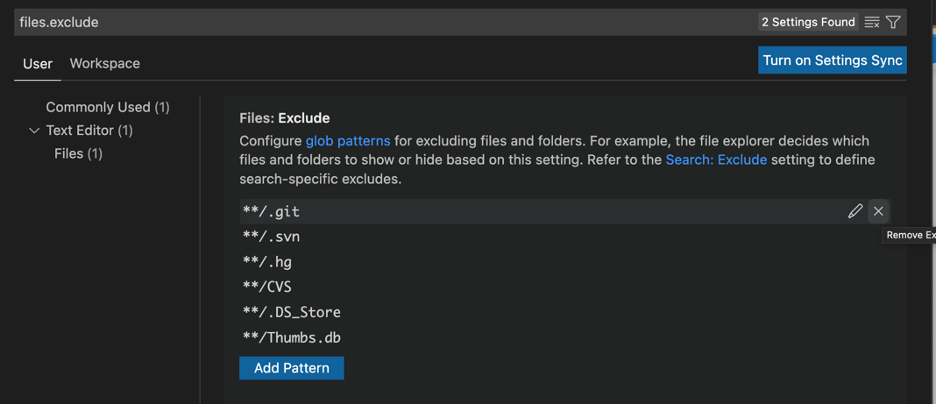
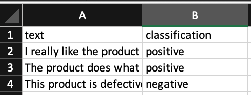
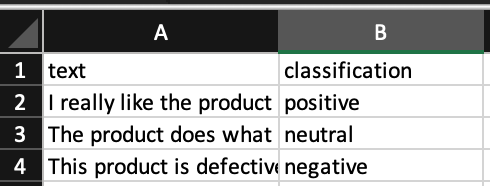
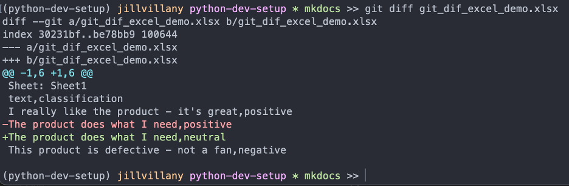

Git does not natively support showing the differences in binary files such as Excel files. 
<br>
<br>
This causes a variety of problems including:

- Unsure if file actually edited - VS Code will usually mark the file modified once it is opened
- Unsure what changes were made

To ease the inconvenience of this, you can make your own custom diff tool.

## Setup Steps

1. Create "excel_to_text_dump.py" with the following code
```
from io import StringIO
import sys

import pandas as pd


for sheet_name in pd.ExcelFile(sys.argv[1]).sheet_names:
    output = StringIO()
    print('Sheet: %s' % sheet_name)
    pd.read_excel(sys.argv[1], sheet_name=sheet_name)\
      .to_csv(output,
              header=True,
              index=False)
    print(output.getvalue())
```

2. Add to .gitattributes file
```
*.xlsx diff=excel
*.xls diff=excel
```
3. Update .git/config file <br>
This creates a filter to convert the file to text so that it can still be compared with git diff

```
[diff "excel"]
	textconv = python {absolute path to file}
```

**NOTE:** The `.git` folder is a hidden folder 

- To view the folder in Mac Finder:
    - `shift + cmd + .`
- To view the folder in VS Code:
    - Go into VS Code's Preferences > Settings
    - Search for `files.exclude` and remove the `**/.git` item
        - 

## Push .gitattributes and Excel file

In order for the .gitattributes to take effect it must first at least be committed.

## Run git diff

If there is no output, you know it is just because the file was open. For example:
```
git diff git_dif_excel_demo.xlsx
```


If there were changes,for example changing the text classification of a review in one row from "positive" to "neutral", the output will look like this:

- File before modifications:
    - 
- File after modifications:
    - 
- Git diff output
    - 

## Handle merge conflicts
You can choose to use the version of the file on your active branch (--ours) or the branch you are merging in (--theirs)

For example:
```
git checkout --ours {path to file}
git add {path to file}
```
