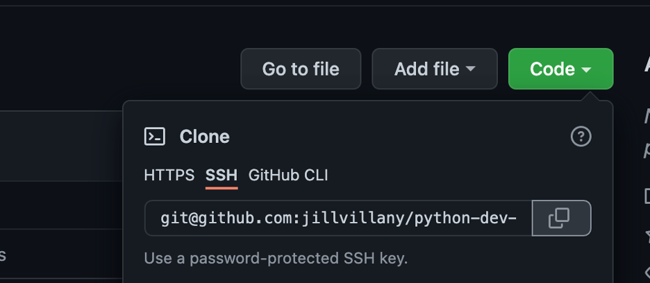
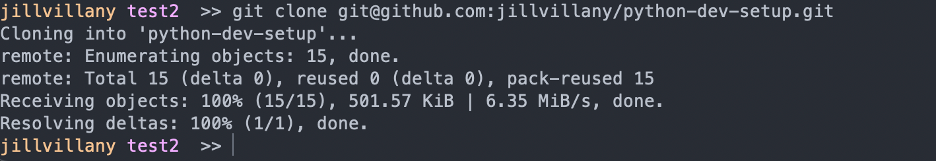
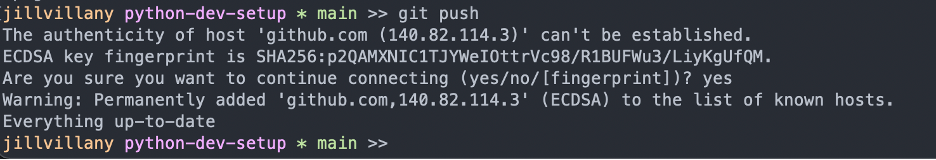

## Get Repo
### Clone repo with SSH auth

**IMP NOTE:** If you are an SSH config file so multiple git users can be on the same machine (i.e. as done in instructions above), you must modify the SSH URL git provides

For example, in `git@github.com:jillvillany/python-dev-setup.git` replace ".com" with "-{username}" -> `git@github-jillvillany:jillvillany/python-dev-setup.git`

1. Select SSH when you clone the code and copy the URL
    - 
2. Enter the command ```git clone {SSH URL}```
    - For example: `git clone git@github.com:jillvillany/python-dev-setup.git`
    - 

### Switch Repo to SSH auth

1. Set the remote URL to the URL used with ssh
    - ```git remote set-url origin {SSH URL}```
2. Now try ```git push```
3. Answer yes to the prompt and you will see git connects/ shows everything up to date without prompting for username/ password
    - 

### Maintain a Forked Repo

To sync your forked version of the repo with the most updated version of the main repo:

1. ```git checkout master```
2. If not already done: ```git remote add upstream {ssh url}``` 
3. ```git fetch upstream```
4.  ```git rebase upstream/master```
5.  ```git push -u origin```


## File Changes

### Add new/ modified files
```
git pull 
git add {relative file path}
git commit -m "commit message"
git push
```
**IMPORTANT:** If multiple users are working in the directory, be sure to set the git config user.email before pushing so that commits belong to the user that made the change
```
git config user.email {your email}
```

### Amend last commit message
```
git commit --amend
```

### See text of unpushed commit
```
git cherry -v
```

### Undo all local changes to the checked out branch
```
git stash
```

### Undo local changes to a particular file
```
git checkout --{file name}
```

## Branches 

### Create & Publish a New Branch
```
git checkout -b {branch name} {branch making new branch from}
git push -u origin {branch name}
```

### Archive & Delete a Branch

```
git tag archive/{branchname} {branchname}
git push origin --tags
git branch -d {branchname}
git push -d origin {branch_name}
```

**NOTE:** If need to delete a created tag

```
git tag -d
```

#### archive_branch.sh
The process of archiving numerous branches can get tedious. See the <a href="../archive_branch">archive_branch.sh</a> script for an automated way to archive branches.

### Restore an archived branch
```
git checkout -b {branch name} archive/{archived branch name}
```

## Merges

### Abort a merge
```
git merge --abort
```

### Ours vs Theirs
You can choose to use the version of the file on your active branch (--ours) or the branch you are merging in (--theirs)

For example:
```
git checkout --ours {path to file}
git add {path to file}
```

## Undo
### Revert to a previous commit
```
git revert {commit hash}
```
- **NOTE:** See [this stack overflow post](https://stackoverflow.com/questions/4114095/how-do-i-revert-a-git-repository-to-a-previous-commit) for more details

### Revert specific file to previous commit
[Reference: https://ohshitgit.com/](https://ohshitgit.com/)
```
# find a hash for a commit before the file was changed
git log
# use the arrow keys to scroll up and down in history
# once you've found your commit, save the hash
git checkout [saved hash] -- path/to/file
# the old version of the file will be in your index
git commit -m "Wow, you don't have to copy-paste to undo"
```

### Undo last commit - keep changes in staged
```
git reset HEAD~ --soft
```

### Remove file added multiple commits ago
If you accidentally add a file with PII or a file that should be stored with git-lfs, this is super helpful!
```
git rebase -i master
```


## Compare
### Compare your local branch to origin
```
git diff origin/branch name
```

## Git LFS

Git LFS is used to for large file storage.

- Download and install: [Git Large File Storage ](https://git-lfs.github.com/)

### Track a file with git lfs
This will add the file paths to the .gitattributes file <br>
**NOTE:** The .gitattibutes file must be committed before it takes effect

```
git lfs track {path to file}
```

### See files currently tracked
```
git lfs ls-files
```

### See lfs files committed or staged for commit
```
git lfs status
```