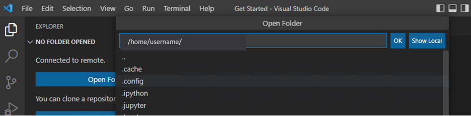

## Install

1. [Download Vscode](https://code.visualstudio.com/download)
2. Install the extensions below (optional):

    - Python
        - Extension ID: ms-python.python
        - 
    - Python Environment Manager
        - Extension ID: donjayamanne.python-environment-manager
        - 
    - Jupyter
        - Extension ID: ms-toolsai.jupyter
        - 
     - Prettify JSON
        - Extension ID: mohsen1.prettify-json
        - 
    - JSON Viewer
        - Extension ID: ccimage.jsonviewer
        - 
    - Markdown Preview Enhanced
        - Extension ID: shd101wyy.markdown-preview-enhanced
        - 
    - Rainbow CSV
        - Extension ID: mechatroner.rainbow-csv
        - 
    - vscode-pdf
        - Extension ID: tomoki1207.pdf
        - 
    - Remote-SSH
        - Extension ID: ms-vscode-remote.remote-ssh
        - 
    - WSL (only if using Windows WSL)
        - Extension ID: ms-vscode-remote.remote-wsl
        - 

**NOTE:** If you are using a remote WSL or SSH server, you will also need to install these packages there.

## Use VSCode with WSL

1. Once you install the WSL extension, navigate to the Remote Explorer tab and connect to your WSL distribution
    - 
2. Navigate to open a folder as you normally would
    - 
3. Install VSCode extensions that are installed locally by navigating to the marketplace and clicking the `Install in WSL:Ubuntu` button
    - 

## Configure Remote-SSH Editing

When project files are hosted on a Linux Machine, you can easily edit/ debug them as you would local files by taking advantage of VS Code's Remote-SSH extension.

To use SSH to connect to a remote Linux machine:

1. Open the Command Palette 
    - Mac: `shift + cmd + P`
    - Windows: `shift + ctrl + P`
2. Search for/ Select Remote-SSH: Add New SSH Host..
    - 
3. Enter the ssh connection command 
    - `ssh {username}@{ip}`
    - 
4. Select the ssh file to update 
    - 
5. You will see a pop-up in the bottom right corner that the host has been added
    - 
6. In the Remote Explorer tab, you will now see your new SSH Target. Click the plus folder icon to "Connect to Host in New Window"
    - 
7. A new window will open and you will be prompted to enter your password
    - 
8. Choose the folder in the remote machine you want to open and select "OK"    
    - 
9. You will be prompted for your password one more time
    - 
10. Upon successful connection, you will see the remote machine's ip as well as the git branch you are currently on (if opened to a git repo) in the bottom left corner
    - 

You can now easily edit and debug your code as you would locally. 

### Note on High Security Remote Machines
If you are connecting to the remote machine with a normal user (i.e. non-root user) you will may get access errors when trying to run a ipynb file depending on the user's permissions.

This happens because, in a Unix/Linux system, you can’t bind to external facing ports without super user/root access. 

If you do not have an environment controlled with Puppet, you can try editing the user's permissions to not need password authentication when entering root user mode. However, it is easiest to just test small code snippets in a noteboook file locally.

For more information, see [https://code.visualstudio.com/docs/remote/ssh](https://code.visualstudio.com/docs/remote/ssh)

