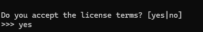
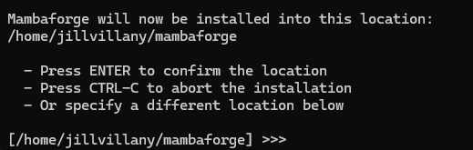
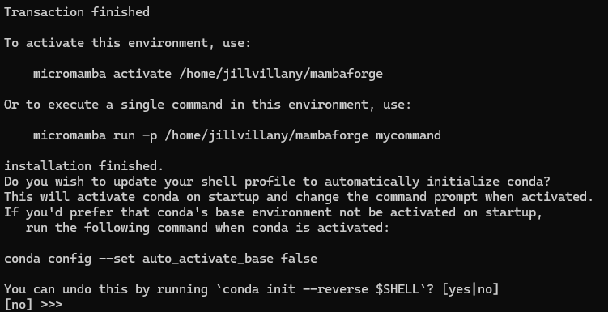
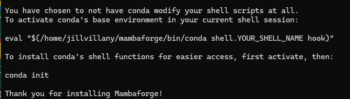
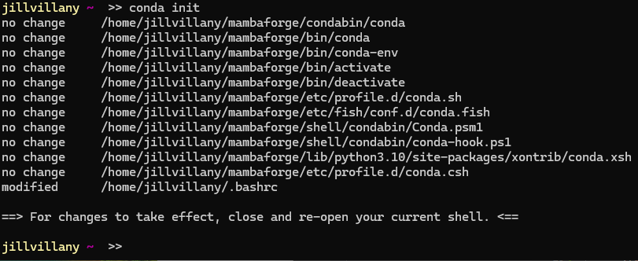
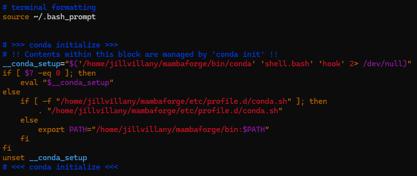
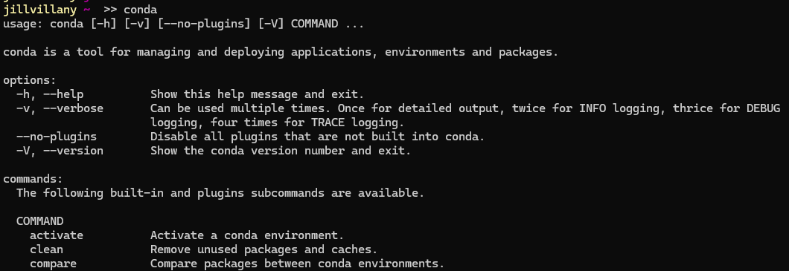

## Install
### Mac

1. Install `wget`
    ```bash
    brew install wget
    ```
2. Install Mambaforge
    ```bash
    wget "https://github.com/conda-forge/miniforge/releases/latest/download/Mambaforge-$(uname)-$(uname -m).sh"
    bash Mambaforge-$(uname)-$(uname -m).sh
    ```

### Windows WSL/ Linux

1. Install `wget` 
    ```bash
    sudo apt install wget
    ```
2. Install Mambaforge
    ```bash
    wget "https://github.com/conda-forge/miniforge/releases/latest/download/Mambaforge-$(uname)-$(uname -m).sh"
    bash Mambaforge-$(uname)-$(uname -m).sh
    source ~/.bashrc
    ```

## Shared Install Instructions
1. Respond to install prompts
    - Accepts the license
      - 
    - Accept the default install location
      - 
    - Accept default to not update shell profile
      - 
    - 
2. Run `conda init`
    -  
    -  This will add the conda init to your `.bashrc` file
       -  
3. If not done already, add sourcing `.bashrc` to your `.bash_profile` so conda is initialized when your terminal loads
    ```
    source ~/.bashrc
    ```
4. Now when you open your terminal and run the command `conda` you will see:
   - 

## Useful Mambaforge Commands

- Create new conda python virtual environment
    * Note: If it asks you to select y/n, enter "y"
        ```bash
        conda create -n {name} python={version}
        ```
- Activate conda environment
    ```bash
    conda activate {name}
    ```
- Deactivate conda environment
    ```bash
    source deactivate
    ```
