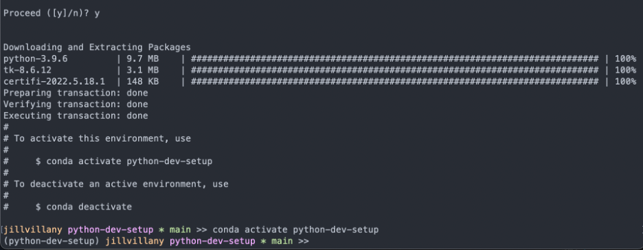
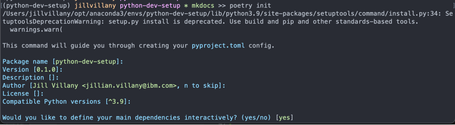
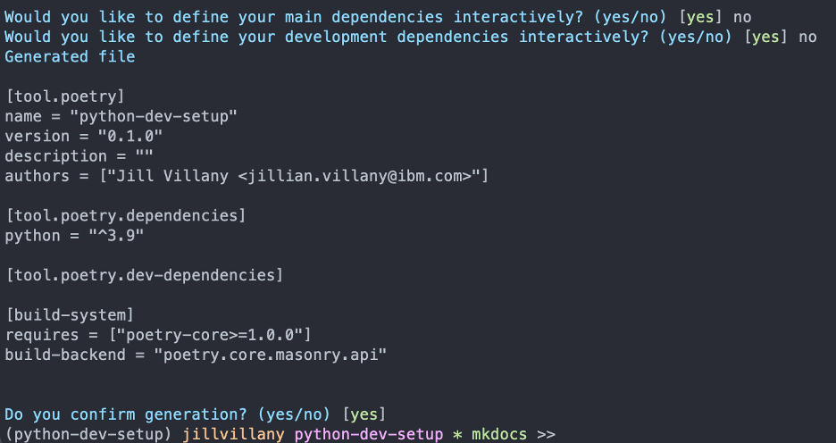

## Install

- Install `poetry` with the following command:
    ```curl -sSL https://raw.githubusercontent.com/python-poetry/poetry/master/get-poetry.py | python -```
- Restart your terminal
- Enter `poetry` and you should see a list of commands returned

## Specify Project Dependencies

When you are first creating the project, you will use `poetry init` to interactively create the `pyproject.toml` file.

For example, to create specify this project's dependencies, I followed the steps below:

1. Create a conda environment with the same name as the project folder

    - `conda create -n python-dev-setup python=3.9`
    - 

2. Run `poetry init`

    - Press enter to accept the defaults until you get to the questions on defining dependencies interactivaly
        - 
    - I find it easier to specificy the dependencies individually later vs. at this step. So, I enter no to both questions and then press enter to confirm generation.
        - 

3. You will now see a `pyproject.toml` file created

**NOTE:** If you are converting a project that currently uses a `requirements.txt` file, you can just fill in the template below instead of using poetry init:

        ```
        [tool.poetry]
        name = "{repo/project name}"
        version = "1.0.0"
        description = "{free text description}"
        readme = "README.md"
        repository = "{git repo link}"
        documentation = "{site url if applicable}"
        authors = [
            "{full name} <{email}>"
        ]

        [tool.poetry.dependencies]
        python = "=={Python version}"

        [tool.poetry.dev-dependencies]

        [build-system]
        requires = ["poetry-core>=1.0.0"]
        build-backend = "poetry.core.masonry.api"
        ```

## Create poetry.lock file

The first time you run `poetry install` or add a package with `poetry add {package name}`, the `poetry.lock` file is created 

After adding the dependencies needed with `poetry add`, push the `pyproject.toml` and `poetry.lock` files to the remote repo. 

## Install Project Dependencies


Now that the lock file is created, other team members can simply:

1. Create a conda environment using python version 3.9
2. Run `poetry install`

After these steps, they will be working with the same dependencies you are using!

## Useful Poetry Commands

### Install requirements
```
poetry install
```

### Add a package
This will install the latest package version. The `pyproject.toml` will show a version greater than or equal to the version is required and the `poetry.lock` file will update to specify the specific version installed.
```
poetry add {package name}
```

- **NOTE:** If you need to install a version other than the latest version, you can specify `poetry add {package name}=={version}`

### Remove a package
This will update the `pyproject.toml` and `poetry.lock` files
```
poetry remove {package name}
```

### Convert `poetry.lock` file to `requirements.txt`
```
poetry export -f requirements.txt -o requirements.txt --without-hashes
```
