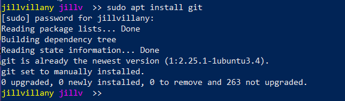
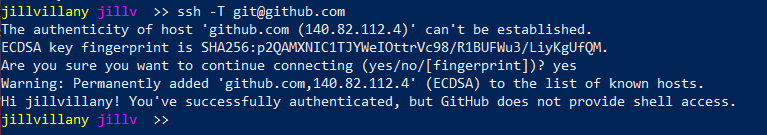

## Git Install
### Mac

1. 	Install Apple Xcode developer tools
    - ```xcode-select --install```
2. Download Homebrew: https://brew.sh/
    - Homebrew helps you easily manage installs on a Mac from command-line
3. Install git using homebrew <br>
    - ```brew install git```

### Windows

1. From PowerShell, open your Ubuntu Linux distribution with `wsl` and run the command ` apt install git`
    - 
    - NOTE: If you forgot your password (or were not prompted to set one upon initial WSL install), you can reset your password using the following steps:
        - Exit the Linux distribution you are in with the command `exit`
        - Re-enter the Linux distribution as the root user `wsl -u root`
        - Enter the command `passwd {your username}` and type in the new password
            - 
            - NOTE: your username is what you saw in the command prompt when you weren't at the root
                - 
        - Exit the Linux Distribution with `exit`

### Red Hat Linux

1. Switch to the super user (a.k.a root user)
    - ```sudo su```
2. Enter your password
3. Install git
    - ```yum install git```
4. Switch back to a normal user
    - ```exit```

## Set Git Username and Email

In order to commit/ push code to Git you must configure your username and email.

1. `git config --global user.name {your username}`
2. `git config --global user.email {your email}`

## Configure SSH Auth

To easily authenticate with Github/ Bitbucket (i.e. not need to enter your username/ password every time you pull/push to the repo) you can set up SSH authentication.

Setting up git authentication on a personal machine (i.e. one that only you will be using) is very simple. However, if multiple user may be using the machine (i.e. a Linux Machine shared by a development team) you will want to follow a few additional step so that commits can be distinguished by user.


### Personal Machine SSH Auth

1. Create an SSH key pair with the command `ssh-keygen` and press enter to accept all the default
    - 
2. Copy the content of the id_rsa.pub file using the `cat {path to your file}` command
    - For example, `cat ~/.ssh/id_rsa.pub`
3. See the [Machine Type Agnostic Steps](#machine-type-agnostic-steps) section for remaining steps

### Shared Machine SSH Auth

1. Create an SSH key pair with the command `ssh-keygen`, adding your git profile to the end of the id_rsa file name instead of accepting all default
    - For example: 
        `Users/jillvillany/.ssh/id_rsa_jillvillany`
        - 
2. Navigate to where the ssh key pair was created using the `cd {path to ssh folder}` command
    - For example: `cd Users/jillvillany/.ssh`
3. Create the config file
    ```
    touch config
    vim config
    ```
    - **NOTE:** Git username vairable is case sensitive
    - If using Github, add the below to your config file:
        ```
        Host github-{git username}
         HostName github.com
         IdentityFile ~/.ssh/id_rsa_{git username}
         IdentitiesOnly yes
        ```
    - If using Github Enterprise (i.e. IBM), add the below to yuur config file:
        ```
        Host github-{git username}
            HostName github.ibm.com
            IdentityFile ~/.ssh/id_rsa_{git username}
            IdentitiesOnly yes
        ```
    - If Bitbucket:
        ```
        Host bitbucket.org-{git username}
         HostName bitbucket.org
         User git
         IdentityFile ~/.ssh/id_rsa_{git username}
         IdentitiesOnly yes
        ```
    - **NOTE:** If you have other users to add, create similar entries below in the file
4. Copy the contents of the `id_rsa_{git username}.pub` file using the `cat id_rsa_{git username}.pub` command

### Machine Type Agnostic Steps

5. Add SSH key in Github or Bitbucket  
    - In Github:
        - Navigate to Settings > SSH and GPG keys
        - 
        - Click New SSH key and add the contents of your `id_rsa_{git username}.pub` file in the key field
    - In Bitbucket:
        - Navigate to personal settings
        - 
        - Select SSH Key > Add Key add the contents of your `id_rsa_{git username}.pub` file in the key field
6. Add the SSH key to the SSH agent
    ```
    ssh-add ~/.ssh/id_rsa_{git username}
    ```
    - NOTE: if you get an error about connecting to the ssh agent, you need to start the agent in the background with "eval \`ssh-agent\`"
    - 
7. Test your SSH connection
    - If on a personal machine:
        - Github: ```ssh -T git@github.com```
            - 
        - Github Enterprise (i.e. IBM): ```ssh -T git@github.ibm.com```
        - Bitbucket: ```ssh -T git@bitbucket.org```
    - If on a shared machine:
        - Github: ```ssh -T git@github-{your username}```
        - Github Enterprise (i.e. IBM): ```ssh -T git@github.ibm-{your username}```
        - Bitbucket: ```ssh -T git@bitbucket.org-{your username}```


## Useful Git Commands

<table>
  <tr>
    <th>Description</th>
    <th>Commands</th>
    <th>Notes</th>
  </tr>
  <tr>
    <td>Clone repo with SSH auth</td>
    <td>
        <ul>
            <li>On a new repo</li>
                <ul>
                    <li>Select SSH when you clone the code and copy the URL</li>
                        <ul>
                            <li></li>
                        </ul>
                    <li>Enter the command <mark>git clone {SSH URL}</mark></li>
                        <ul>
                            <li>For example: <mark>git clone git@github.com:jillvillany/python-dev-setup.git</mark></li>
                            <li></li>
                        </ul>
                </ul>
            <li>On an existing git repo (i.e. if had cloned this repo using username and password auth)</li>
                <ul>
                    <li>Set the remote URL to the URL used with ssh</li>
                        <ul>
                            <li><mark>git remote set-url origin {SSH URL}</mark></li>
                        </ul>
                    <li>Now try <mark>git push</mark></li>
                    <li>Answer yes to the prompt and you will see git connects/ shows everything up to date without prompting for username/ password</li>
                        <ul>
                            <li></li>
                        </ul>
                </ul>
        </ul>
    </td>
    <td>
        <ul>
            <li> <b>IMP NOTE:</b> If you are an SSH config file so multiple git users can be on the same machine (i.e. as done in instructions above), you must modify the SSH URL git provides</li>
            <ul>
                <li>For example, in <mark>git@github.com:jillvillany/python-dev-setup.git</mark> replace <mark>.com</mark> with <mark>-{username}</mark> -> <mark>git@github-jillvillany:jillvillany/python-dev-setup.git<mark><li>
            </ul>
        </ul>
    </td>
  </tr>
  <tr>
    <td></td>
    <td></td>
    <td></td>
  </tr>
</table>


- Clone repo with SSH auth
    - **IMP NOTE**: If you are an SSH config file so multiple git users can be on the same machine (i.e. as done in instructions above), you must modify the SSH URL git provides
        - For example, in `git@github.com:jillvillany/python-dev-setup.git` replace ".com" with "-{username}" -> `git@github-jillvillany:jillvillany/python-dev-setup.git`
    - On a new repo:
        - Select SSH when you clone the code and copy the URL
            - 
        - Enter the command ```git clone {SSH URL}```
            - For example: `git clone git@github.com:jillvillany/python-dev-setup.git`
            - 
    - On an existing git repo (i.e. if had cloned this repo using username and password auth)
        - Set the remote URL to the URL used with ssh
        - ```git remote set-url origin {SSH URL}```
        - Now try ```git push```
        - Answer yes to the prompt and you will see git connects/ shows everything up to date without prompting for username/ password
            - 


- Add new/ modified files, commit and push changes
    ```
    git pull 
    git add {relative file path}
    git commit -m "commit message"
    git push
    ```
    - **IMPORTANT:** If multiple users are working in the directory, be sure to set the git config user.email before pushing so that commits belong to the user that made the change
    ```
    git config user.email {your email}
    ```
- Undo all local changes to the checked out branch
    ```
    git stash
    ```
- Undo local changes to a particular file
    ```
    git checkout --{file name}
    ```
- Create a New Branch
    ```
    git checkout -b {branch name} {branch making new branch from}
    git push -u origin {branch name}
    ```
- Abort a merge
    ```
    git merge --abort
    ```
- Revert to a previous commit
    ```
    git revert {commit hash}
    ```
    - **NOTE:** See [this stack overflow post](https://stackoverflow.com/questions/4114095/how-do-i-revert-a-git-repository-to-a-previous-commit) for more details
- Archive & Delete a Branch
    ```
    git tag archive/{branchname} {branchname}
    git push origin --tags
    git branch -d {branchname}
    git push -d origin {branch_name}
    ```
    - **NOTE:** If need to delete a created tag
    ```
    git tag -d
    ```
    - **NOTE:** The process of archiving numerous branches can get tedious. See the [archive_branch.sh](https://github.com/jillvillany/python-dev-setup/blob/main/archive_branch.sh) script in this repo for an automated way to archive branches.
- Restore an archived branch
    ```
    git checkout -b {branch name} archive/{archived branch name}
    ```
-  Maintain a Forked Repo
    - Sync your forked version of the repo with the most updated version of the main repo
        - ```git checkout master```
        - If not already done: ```git remote add upstream {ssh url}``` 
        - ```git fetch upstream```
        - ```git rebase upstream/master```
        - ```git push -u origin```

For other useful commands delivered in an entertaining way see: https://ohshitgit.com/
