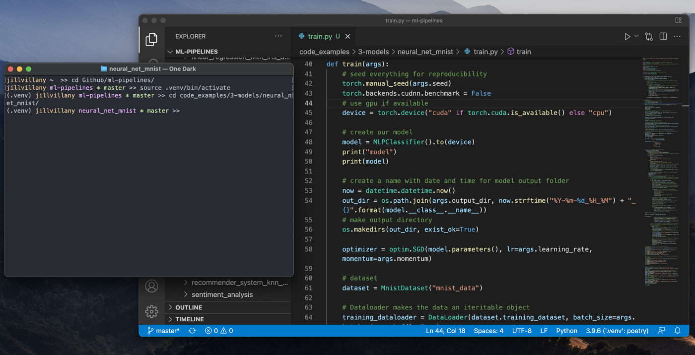

## Table of Contents

<table>
  <tr>
    <th>Task</th>
    <th>Recommended Tool</th>
    <th>Content</th>
  </tr>
  <tr>
    <td>
    <a href="1-run_scripts_cmd_line">1. Run Scripts from Command Line</a>
    </td>
    <td>
        <ul>
            <li>Mac Users: Terminal</li>
            <li>Windows Users: WSL</li>
        </ul>
    </td>
    <td> 
        <ul>
            <li><a href="1-run_scripts_cmd_line/#set-up-a-wsl-environment">Windows Users: Install/ Configure WSL</a></li>
            <li><a href="1-run_scripts_cmd_line/#format-your-terminal">Format your terminal</a></li>
        </ul>
    </td>
  </tr>
  <tr>
    <td><a href="2-git_version_control">2. Version Control Your Code</a></td>
    <td>Git</td>
    <td>
        <ul>
            <li><a href="2-git_version_control/#install">Install</a></li>
            <li><a href="2-git_version_control/#configure-ssh-auth">Configure SSH Auth</a></li>
            <li><a href="2-git_version_control/useful_git_commands">Useful Commands</a></li>
            <li><a href="2-git_version_control/git_dif_excel_workaround">Git Diff Excel Workaround</a></li>
            <li>Script automations:</li>
                <ul>
                    <li><mark><a href="2-git_version_control/archive_branch">archive_branch.sh</a></mark></li>
                    <li><mark><a href="2-git_version_control/sync_git_branches">sync_git_branches.sh</a></mark></li>
                </ul>
        </ul>
    </td>
  </tr>
    <tr>
    <td><a href="3-edit_with_vscode">3. Edit and Debug Your Code</a></td>
    <td>VS Code</td>
    <td> 
        <ul>
            <li><a href="3-edit_with_vscode/#install">Install</a></li>
            <li><a href="3-edit_with_vscode/#use-vscode-with-wsl">Use VSCode with WSL</a></li>
            <li><a href="3-edit_with_vscode/#configure-remote-ssh-editing">Configure Remote-SSH Editing</a></li>
        </ul>
    </td>
  </tr>
  <tr>
    <td><a href="4-mambaforge_python_env">4. Manage Your Python Version</a></td>
    <td>Mambaforge</td>
    <td> 
        <ul>
            <li><a href="4-mambaforge_python_env/#install">Install</a></li>
            <li><a href="4-mambaforge_python_env/#useful-mambaforge-commands">Useful Mambaforge commands</a></li>
        </ul>
    </td>
  </tr>
  <tr>
    <td><a href="5-poetry_package_manager">5. Manage Your Python Package Versions</a></td>
    <td>Poetry</td>
    <td> 
        <ul>
            <li><a href="5-poetry_package_manager/#install">Install</a></li>
            <li><a href="5-poetry_package_manager/#use-poetry-to-install-project-dependencies">Use Poetry To Install Project Dependencies</a></li>
            <li><a href="5-poetry_package_manager/#useful-poetry-commands">Useful Poetry commands</a></li>
        </ul>
    </td>
  </tr>
</table>

## Overview

To have a good environment setup, you must have tools to efficiently perform the following 5 tasks:

1. Run scripts from command line
2. Version control your code
3. Edit and debug your code
4. Manage the Python version you use to run your code
5. Manage the Python package versions you use to run your code

A good environment setup is key to many things including:

- Team collaboration
- Production Readiness
- Time saving

In this site, tool recommendations, install/ configuration instructions and common commands are provided to ensure you can easily create a setup you'll love.

For more details see the following Medium Article: 

<a href="https://towardsdatascience.com/fall-in-love-with-your-environment-setup-779dfbf047ba">
    

        

            Fall in Love with Your Environment Setup 
            A Python developer’s guide to the optimal setup for collaboration, production readiness and time saving
        

        

            
        

    

</a>
