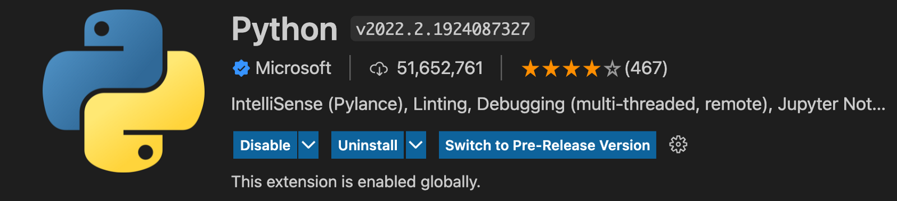
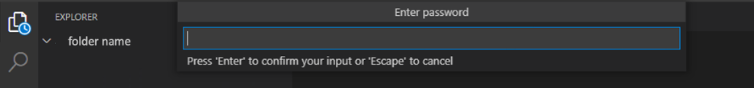

# python-dev-setup

## 2. Version Control Your Code - Git


## 3. Edit and Debug Your Code - Vscode
[Back to Table of Contents](#Table-of-Contents)

### Install VS Code and Key Extensions

1. Download Vscode: https://code.visualstudio.com/download
2. Install the extensions below:

    - Python
        - Extension ID: ms-python.python
        - 
    - Jupyter
        - Extension ID: ms-toolsai.jupyter
        - 
     - Prettify JSON
        - Extension ID: mohsen1.prettify-json
        - 
    - JSON Viewer
        - Extension ID: ccimage.jsonviewer
        - 
    - Markdown Preview Enhanced
        - Extension ID: shd101wyy.markdown-preview-enhanced
        - 
    - Rainbow CSV
        - Extension ID: mechatroner.rainbow-csv
        - 
    - vscode-pdf
        - Extension ID: tomoki1207.pdf
        - 
    - Remote-SSH
        - Extension ID: ms-vscode-remote.remote-ssh
        - 
    - Remote-WSL (only if using Windows WSL)
        - Extension ID: ms-vscode-remote.remote-wsl
        - 


### Use VSCode with WSL
[Back to Table of Contents](#Table-of-Contents)


1. Once you install tyhe Remote-WSL, navigate to the Remote Explorer tab and connect to your WSL distribution
    - 
2. Navigate to open a folder as you normally would
    - 


### Configure Remote-SSH Editing
[Back to Table of Contents](#Table-of-Contents)

When project files are hosted on a Linux Machine, you can easily edit/ debug them as you would local files by taking advantage of VS Code's Remote-SSH extension.

To use SSH to connect to a remote Linux machine:

1. Open the Command Palette 
    - Mac: `shift + cmd + P`
    - Windows: `shift + ctrl + P`
2. Search for/ Select Remote-SSH: Add New SSH Host...
    - 
3. Enter the ssh connection command 
    - `ssh {username}@{ip}`
    - 
4. Select the ssh file to update 
    - 
5. You will see a pop-up in the bottom right corner that the host has been added
    - 
6. In the Remote Explorer tab, you will now see your new SSH Target. Click the plus folder icon to "Connect to Host in New Window"
    - 
7. A new window will open and you will be prompted to enter your password
    - 
8. Choose the folder in the remote machine you want to open and select "OK"    
    - 
9. You will be prompted for your password one more time
    - 
10. Upon successful connection, you will see the remote machine's ip as well as the git branch you are currently on (if opened to a git repo) in the bottom left corner
    - 

You can now easily edit and debug your code as you would locally. However, there is one exception. If you are connecting to the remote machine with a normal user (i.e. non-root user) you will get access errors when trying to run a ipynb file.


This happens because, in a Unix/Linux system, you can’t bind to external facing ports without super user/root access. 

If you do not have an environment controlled with Puppet, you can try editing the user's permissions to not need password authentication when entering root user mode. However, it is easiest to just test small code snippets in a noteboook file locally.

For more information, see [https://code.visualstudio.com/docs/remote/ssh](https://code.visualstudio.com/docs/remote/ssh)


## 4. Manage Your Python Version - Mambaforge
[Back to Table of Contents](#Table-of-Contents)


### Mac Mambaforge Install
[Back to Table of Contents](#Table-of-Contents)

1. Install `wget`
    ```bash
    brew install wget
    ```
2. Install Mambaforge (Type "yes" wherever asked)
    ```bash
    wget "https://github.com/conda-forge/miniforge/releases/latest/download/Mambaforge-$(uname)-$(uname -m).sh"
    bash Mambaforge-$(uname)-$(uname -m).sh
    ```

### Windows WSL/ Linux Mambaforge Install
[Back to Table of Contents](#Table-of-Contents)

1. Install `wget` 
    ```bash
    sudo apt install wget
    ```
3. Install Mambaforge (Type "yes" wherever asked)
    ```bash
    wget "https://github.com/conda-forge/miniforge/releases/latest/download/Mambaforge-$(uname)-$(uname -m).sh"
    bash Mambaforge-$(uname)-$(uname -m).sh
    source ~/.bashrc

### Useful Mambaforge Commands
[Back to Table of Contents](#Table-of-Contents)

- Create new conda python virtual environment
    * Note: If it asks you to select y/n, enter "y"
        ```bash
        conda create -n {name} python={version}
        ```
- Activate conda environment
    ```bash
    conda activate {name}
    ```
- Deactivate conda environment
    ```bash
    conda deactivate
    ```


## 5. Manage Your Python Package Versions - Poetry
[Back to Table of Contents](#Table-of-Contents)

### Install Poetry

- Install `poetry` with the following command:
    ```curl -sSL https://raw.githubusercontent.com/python-poetry/poetry/master/get-poetry.py | python -```
- Restart your terminal
- Enter `poetry` and you should see a list of commands returned

### Use Poetry To Install Project Dependencies
[Back to Table of Contents](#Table-of-Contents)

**NOTE:** For demo purposes, let's pretend this project is dependent on Python version 3.9.6 and pandas

1. Create a `pyproject.toml` file using the following template (See this repo's [pyproject.toml](https://github.com/jillvillany/python-dev-setup/blob/main/pyproject.toml)):
    - NOTE: We are assuming this repo represents a project dependent on Python version 3.9.6 and a pandas version greater than or equal to 1.4.1

        ```
        [tool.poetry]
        name = "{repo/project name}"
        version = "1.0.0"
        description = "{free text description}"
        readme = "README.md"
        repository = "{git repo link}"
        documentation = "{site url if applicable}"
        authors = [
            "{full name} <{email}>"
        ]

        [tool.poetry.dependencies]
        python = "=={Python version}"

        [tool.poetry.dev-dependencies]

        [build-system]
        requires = ["poetry-core>=1.0.0"]
        build-backend = "poetry.core.masonry.api"
        ```
        
2. Create a conda environment that uses the Python version specified in the `pyproject.toml` file and active the environment

    - `conda create -n python-dev-setup python=3.9.6`
    - 


3. Run command `poetry install`

    - 
    - NOTE: You will see a `poetry.lock` file created. This is important to be committed to your repo so that other team members can install the dependencies from the lock file by running `poetry install`


### Useful Poetry Commands
[Back to Table of Contents](#Table-of-Contents)

- Install the requirements in the poetry.lock file
    ```
    poetry install
    ```
- Add a package to the pyproject.toml file and update lock file
    ```
    poetry add {package name}
    ```
    - **NOTE1:** This will install the latest package version. The pyproject.toml will show a version greater than or equal to the version is required and the poetry.lock file will update to specify the specific version installed.
     - **NOTE2:** If you need to install a version other than the latest version, you can specify `poetry add {package name}=={version}`
- Remove a package from the pyproject.toml file and update lock file
    ```
    poetry remove {package name}
    ```
